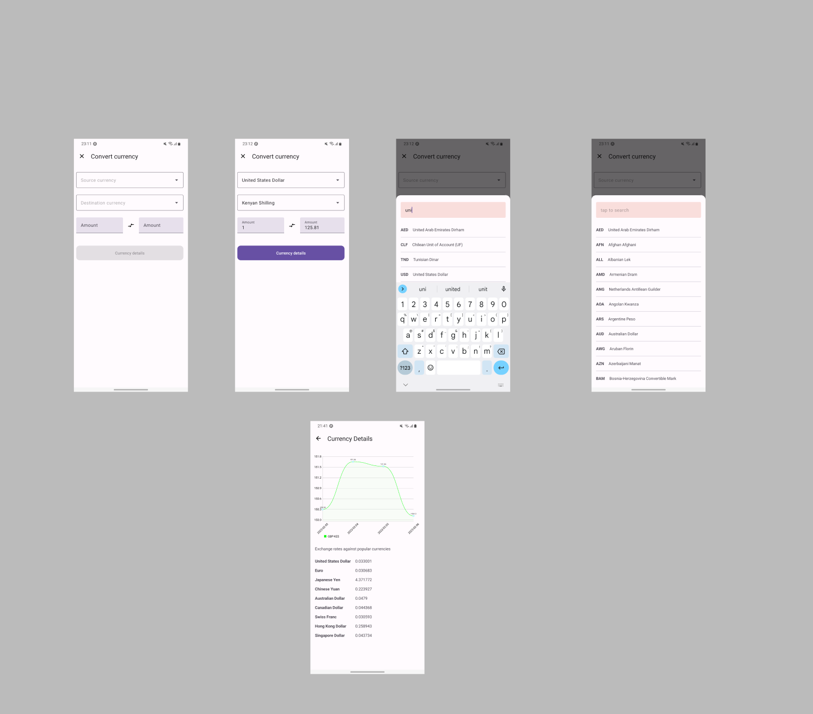

# Currency Converter

## Pre Requisities

- [A valid Fixer API key](https://apilayer.com/marketplace/fixer-api?_gl=1*h9y3ex*_ga*MTIwMDIzMTYzMi4xNjc1NTA0OTkx*_ga_HGV43FGGVM*MTY3NTYyNzA4Ni40LjEuMTY3NTYyNzA5NS41MS4wLjA.#pricing)

## Setup

- Add `CURRENCY_API_KEY` to your `local.properties` file
- Pase `https://api.apilayer.com/fixer/` to `BASE_URL` on your `local.properties` file.
- Build the project

### Background

Develop an application that:

- Can convert currencies between different bases
- Has an input field for amount (numbers only), by default always 1, and another input
  field to show the converted value
- Button to swap the values in FROM and TO, and accordingly converted data
  changed
- Show historical data for FROM/TO selections in last 3 days (day by day) - List and chart
- Rates converted to some other popular currencies.

## Tech-stack

* Tech-stack
    * [Kotlin](https://kotlinlang.org/) - a cross-platform, statically typed, general-purpose
      programming language with type inference.
    * [Coroutines](https://kotlinlang.org/docs/reference/coroutines-overview.html) - perform
      background operations.
    * [Flow](https://kotlinlang.org/docs/reference/coroutines/flow.html) - handle the stream of data
      asynchronously that executes sequentially.
    * [Hilt](https://developer.android.com/training/dependency-injection/hilt-android) - Hilt is a
      dependency injection library for Android that reduces the boilerplate of doing manual
      dependency injection in your project.
    * [Retrofit](https://square.github.io/retrofit/) - A type-safe HTTP client for Android.
    * [Jetpack](https://developer.android.com/jetpack)
     
        * [Lifecycle](https://developer.android.com/topic/libraries/architecture/lifecycle) -
          perform action when lifecycle state changes.
        * [ViewModel](https://developer.android.com/topic/libraries/architecture/viewmodel) - store
          and manage UI-related data in a lifecycle conscious way.
        * [Jetpack Navigation](https://developer.android.com/guide/navigation/navigation-getting-started) -
          Implement navigation, from simple button clicks to more complex patterns, such as app bars
          and the navigation drawer.

* Architecture
    * [MVVM](https://developer.android.com/topic/architecture) - Model View View Model in conjunction with [modularization architecture](https://developer.android.com/topic/modularization)
* Tests
    * [Unit Tests](https://en.wikipedia.org/wiki/Unit_testing) ([JUnit](https://junit.org/junit4/)) -
      a simple framework to write repeatable tests.
    * [Turbine](https://github.com/cashapp/turbine) - Turbine is a small testing library for kotlinx.coroutines
    * [Coroutines tests](https://kotlinlang.org/api/kotlinx.coroutines/kotlinx-coroutines-test/) - Test utilities for `kotlinx.coroutines`.
    * [Truth](https://github.com/google/truth) - Truth makes your test assertions and failure
      messages more readable.

* CI/CD
    * Github Actions

# Screenshots of the App:

https://user-images.githubusercontent.com/17246592/216999134-862a3da4-bff5-4d24-b2d6-41e9b752ea8f.mp4

# Screenshot of Tests running

# Happy Coding!

